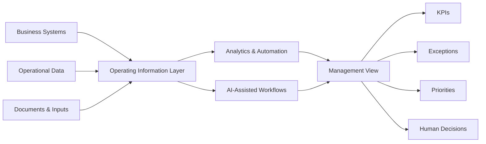
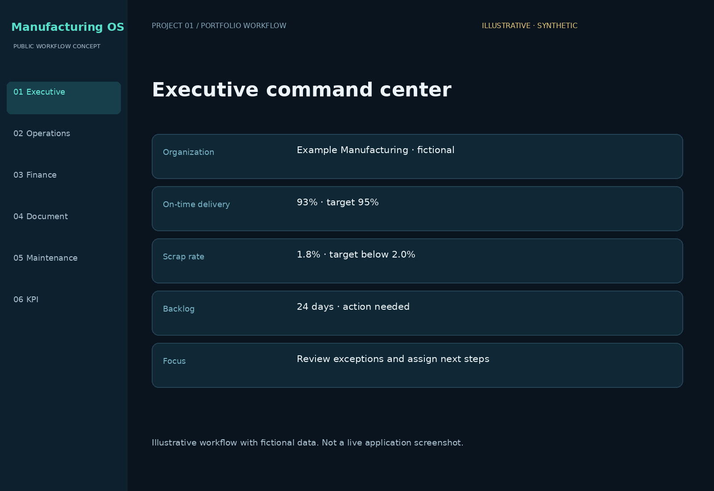
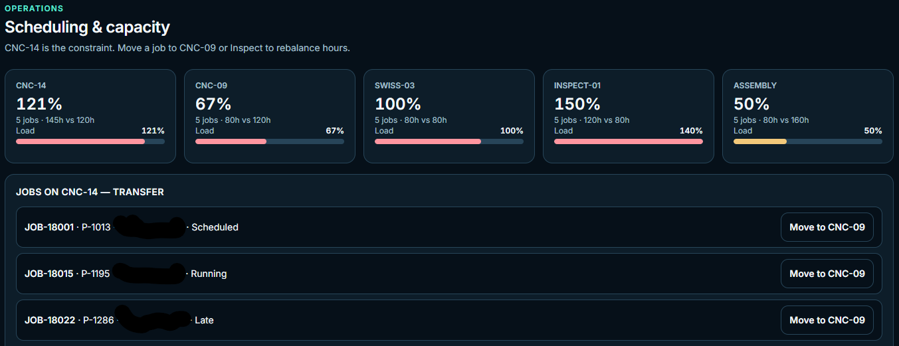
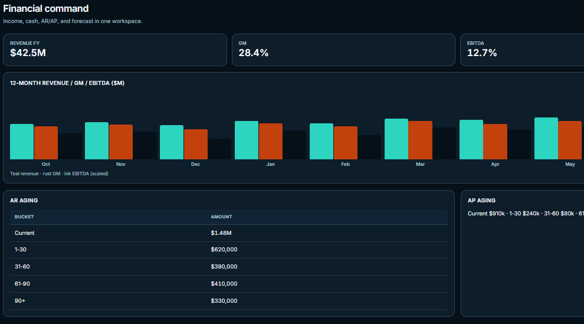
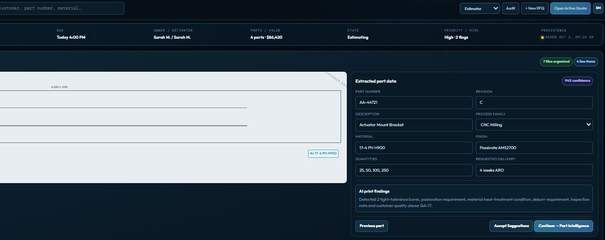
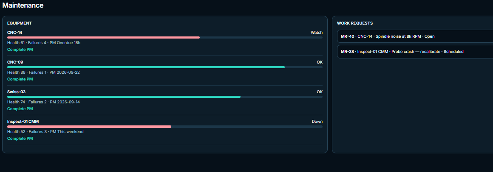
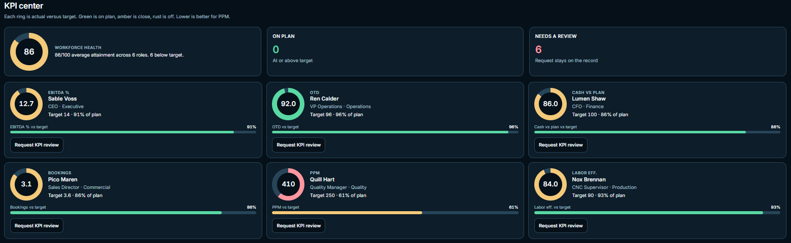

# Executive & Manufacturing Operating System

> Public portfolio overview of an AI-enabled operating system concept for manufacturing leaders.

---

## Overview

This repository is a **sanitized public portfolio case study**.

It shows the business problem, product direction, selected capabilities, and the operating philosophy behind the concept without publishing proprietary implementation details, private workflows, source code, prompt logic, internal decision rules, or confidential data.

**Core implementation and proprietary workflows are maintained privately.**

---

## Why I Built This

After decades working in manufacturing and executive operations, I have seen the same challenge repeatedly:

Organizations often have plenty of data, but it is spread across ERP systems, spreadsheets, emails, maintenance records, quality systems, accounting platforms, and individual managers.

The result is unnecessary effort spent gathering and reconciling information before leaders can act.

This project explores how a clearer operating environment can help management teams see what matters, identify issues earlier, and make better-informed decisions.

---

## The Business Problem

Manufacturing organizations commonly face:

- Disconnected operational and financial data
- Delayed KPI reporting
- Manual status updates
- Limited visibility into capacity and constraints
- Separate maintenance, quality, purchasing, and production workflows
- Repetitive document review
- Too much management time spent gathering information
- Difficulty connecting operating issues to financial impact

---

## The Concept

The system is designed as a management layer that brings critical business information into one clearer operating view.

### Selected business areas

| Area | Public portfolio description |
|---|---|
| Executive Command Center | Business health, priorities, risks, and exceptions |
| Operations | Throughput, capacity, backlog, delivery, and performance visibility |
| Finance | Cash, receivables, payables, margin, and forecast visibility |
| Customers | Commitments, concentration, activity, and open issues |
| Quoting | RFQ intake and AI-assisted document intelligence |
| Purchasing | Supplier, inventory, and material visibility |
| Maintenance | Downtime, preventive maintenance, and recurring issues |
| Quality | Issues, trends, corrective actions, and audit readiness |
| People | Accountability, role clarity, KPIs, and staffing visibility |
| Forecasting | Forward-looking operating and capacity planning |

---

## How AI Fits In

The design principle is simple:

> Use AI where it can reduce repetitive work, organize information, surface patterns, and support human decision-making.

Public examples include:

- Summarizing operational exceptions
- Extracting and structuring information from business documents
- Creating management summaries
- Supporting prioritization
- Organizing large amounts of fragmented information
- Assisting with forecasting and scenario review

The detailed orchestration, prompts, decision rules, scoring logic, integrations, and implementation approach are intentionally not published here.

---

## High-Level System View

This diagram is intentionally high level and does not disclose implementation-specific architecture.

---

## Selected Capabilities

### Executive Visibility
Bring critical operational and financial signals into a more useful management view.

### KPI & Accountability
Make ownership, trends, and follow-up easier to see.

### Manufacturing & Capacity
Support visibility into demand, backlog, resources, constraints, and planning.

### Finance & Profitability
Connect operating activity with financial visibility and business performance.

### AI-Assisted Quoting & Document Intelligence
Use AI to extract, organize, and interpret useful information from RFQs and business documents.

### Purchasing & Supplier Visibility
Improve visibility into materials, inventory, supplier activity, and purchasing needs.

### Maintenance Intelligence
Bring downtime, preventive maintenance, and recurring equipment issues into a more usable operating view.

### Continuous Improvement
Capture issues, actions, ownership, and progress over time.

---

## Business Value

The concept is designed around measurable operating outcomes:

- Less time spent preparing management reports
- Faster identification of operational problems
- Better connection between operations and finance
- Improved accountability
- Faster document review
- Better planning visibility
- Reduced administrative work
- More consistent decision-making
- Earlier visibility into risk
- Better use of management time

---

## What Makes the Approach Different

The concept is grounded in an operator's perspective.

It starts with the realities of running a manufacturing business:

- customers
- people
- capacity
- quality
- suppliers
- maintenance
- cash
- margin
- commitments
- execution risk

Technology is applied to support that operating reality rather than becoming the objective itself.

---

## Product Screenshots

### Executive Command Center
A high-level management view designed to surface business health, priorities, risks, and exceptions in one place.

---

### Operations & Capacity
A manufacturing operations view focused on throughput, backlog, capacity, delivery performance, and constraints.

---

### Finance Dashboard
A management-focused view connecting operating activity with cash, receivables, payables, margin, and financial performance.

---

### AI-Assisted Quoting & Document Intelligence
A workflow designed to extract, organize, and interpret information from RFQs and business documents to support faster human review.

---

### Maintenance Intelligence
A view designed to bring preventive maintenance, downtime, recurring issues, and equipment activity into one operating picture.

---

### KPI & Action Tracking
A focused management view for tracking KPIs, ownership, open actions, status, and follow-through.

> All screenshots use sanitized or demonstration data. Core implementation, proprietary workflows, and detailed system logic are maintained privately.

---

## Public vs. Private

### Publicly shown here
- Business problem
- Product direction
- High-level capabilities
- High-level system view
- Sanitized screenshots
- Business value
- Product thinking

### Maintained privately
- Source code
- Detailed architecture
- Database design
- AI prompts and agent instructions
- Decision rules and scoring methods
- Automation logic
- Customer-specific integrations
- Proprietary workflows
- Production credentials and configuration
- Commercial roadmap

---

## Project Status

**Private working prototype / public portfolio overview**

This public repository exists to demonstrate product thinking, operating experience, and applied AI capability while preserving the underlying implementation and intellectual property.

---

## About the Builder

**Federico Veneziano**

30+ years across manufacturing, operations, finance, technology, and business transformation, progressing from manufacturing operator through executive leadership.

- Leadership responsibility across 400+ employees
- CNC machining and machine-tool background
- Process engineering and manufacturing technology
- Operations and financial leadership
- International operating experience
- Applied AI and automation
- DeepLearning.AI Agentic AI certificate
- AWS Certified AI Practitioner — in progress

---

## Contact

**Email:** fveneziano0503@outlook.com  
**GitHub:** [Fveneziano0503](https://github.com/Fveneziano0503)
